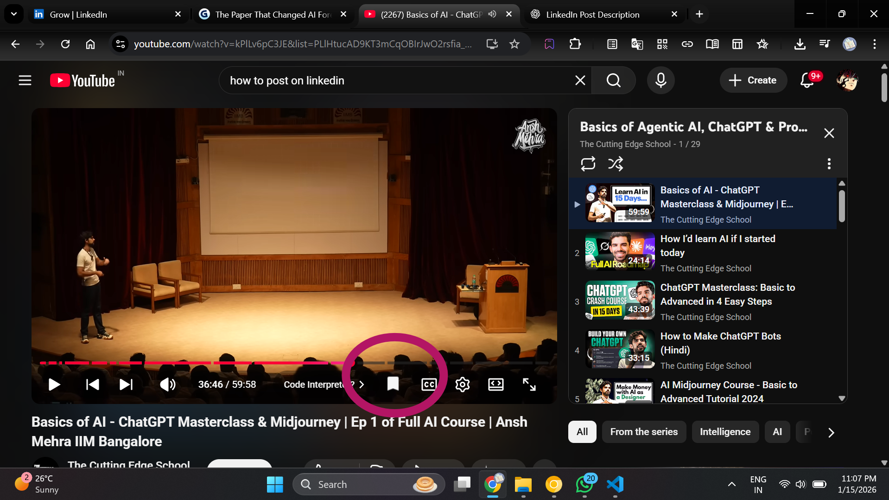
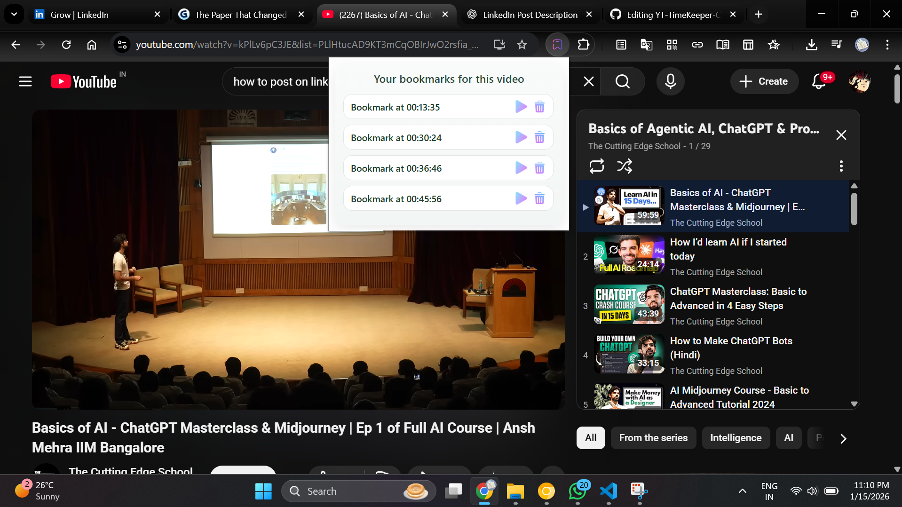

<!-- README.md for YT TimeKeeper Chrome Extension -->

<div align="center">
  <!-- You can link your logo here -->
  <a href="https://github.com/yourusername/yt-timekeeper">
    
  </a>
  <h1>YT TimeKeeper</h1>
  <p><strong>A simple Chrome extension to save and jump to timestamps in YouTube videos.</strong></p>
  
  <!-- Badges -->
  <p>
    
    
    <a href="https://github.com/yourusername/yt-timekeeper"></a>
  </p>
</div>

<hr>

<!-- Introduction Section -->
<div style="background-color: #f0f8ff; border-left: 5px solid #007bff; padding: 15px; margin: 20px 0; border-radius: 5px;">
  <p>Tired of scrubbing through long YouTube videos to find that one important moment? <strong>YT TimeKeeper</strong> lets you create bookmarks at any timestamp, so you can instantly jump back to the parts that matter. Perfect for tutorials, lectures, long-form interviews, and gaming highlights!</p>
</div>

<!-- Screenshots Section -->
<h2>📸 Screenshots</h2>
<div style="display: flex; flex-wrap: wrap; justify-content: space-around; gap: 15px; text-align: center; margin-bottom: 20px;">
  <figure style="border: 1px solid #ddd; padding: 10px; border-radius: 8px; width: 45%; box-shadow: 0 2px 4px rgba(0,0,0,0.1);">
    <!-- Replace with your actual screenshot path -->
    
    <figcaption style="margin-top: 8px; font-size: 0.9em; color: #555;"><em>The bookmark button integrates into YouTube's player controls.</em></figcaption>
  </figure>
  <figure style="border: 1px solid #ddd; padding: 10px; border-radius: 8px; width: 45%; box-shadow: 0 2px 4px rgba(0,0,0,0.1);">
    <!-- Replace with your actual screenshot path -->
    
    <figcaption style="margin-top: 8px; font-size: 0.9em; color: #555;"><em>View all your bookmarks for the current video in a clean popup.</em></figcaption>
  </figure>
  <figure style="border: 1px solid #ddd; padding: 10px; border-radius: 8px; width: 45%; box-shadow: 0 2px 4px rgba(0,0,0,0.1);">
    <!-- Replace with your actual screenshot path -->
    
    <figcaption style="margin-top: 8px; font-size: 0.9em; color: #555;"><em>Easily play or delete any bookmark with a single click.</em></figcaption>
  </figure>
</div>

<!-- Features Section -->
<h2>✨ Features</h2>
<ul>
  <li>📌 <strong>Save Timestamps</strong>: Click the bookmark button to save the current video time.</li>
  <li>📚 <strong>View Bookmarks</strong>: All bookmarks for the current video are displayed in a clean, scrollable list.</li>
  <li>▶️ <strong>Jump to Time</strong>: Instantly skip to any saved timestamp with the play button.</li>
  <li>🗑️ <strong>Delete Bookmarks</strong>: Clean up your list by removing unwanted bookmarks.</li>
  <li>💾 <strong>Synced Storage</strong>: Your bookmarks are saved using Chrome Sync, so they're available on all your logged-in devices.</li>
  <li>🎯 <strong>Video-Specific</strong>: Bookmarks are unique to each video ID, keeping your lists organized.</li>
</ul>

<!-- Installation Guide (Collapsible) -->
<details>
  <summary><h2 style="display: inline;">🚀 Installation</h2></summary>

1.  **Clone the repository:**
    ```bash
    git clone https://github.com/yourusername/yt-timekeeper.git
    ```
2.  **Open Chrome Extensions:** Navigate to `chrome://extensions` in your Chrome browser.
3.  **Enable Developer Mode:** Toggle the "Developer mode" switch in the top-right corner.
4.  **Load the Extension:**
    *   Click the "Load unpacked" button.
    *   Select the `yt-timekeeper` directory you just cloned.
5.  **Done!** The YT TimeKeeper icon will appear in your Chrome toolbar.

</details>

<!-- Usage Guide (Collapsible) -->
<details>
  <summary><h2 style="display: inline;">📖 How to Use</h2></summary>

1.  Go to any YouTube video page.
2.  Navigate to the timestamp you want to save.
3.  Click the new **bookmark icon (📌)** in the video player controls. A bookmark is created!
4.  Click the **YT TimeKeeper icon** in your Chrome toolbar to open the popup.
5.  In the popup, you'll see a list of all saved timestamps for that video.
6.  Click the **play icon (▶️)** next to a bookmark to jump to that time.
7.  Click the **delete icon (🗑️)** to remove a bookmark.

</details>

<!-- Project Structure -->
<h2>📁 Project Structure</h2>

<pre><code>yt-timekeeper/
├── manifest.json         # Extension configuration file
├── popup.html            # The HTML for the extension's popup window
├── popup.js              # Logic for the popup (displaying, deleting bookmarks)
├── popup.css             # Styles for the popup window
├── contentScript.js      # Script injected into YouTube pages
├── background.js         # Service worker for handling browser events
├── utils.js              # Shared utility functions
└── assets/               # Images and icons
    ├── ext-icon.png
    ├── bookmark.png
    ├── play.png
    ├── delete.png
    └── save.png
</code></pre>

<!-- How it Works Section -->
<h2>🛠️ How It Works</h2>
<p>The extension is composed of three main parts that communicate with each other:</p>
<table style="width:100%; border-collapse: collapse;">
  <thead>
    <tr style="background-color: #f2f2f2;">
      <th style="border: 1px solid #ddd; padding: 8px; text-align: left;">Component</th>
      <th style="border: 1px solid #ddd; padding: 8px; text-align: left;">Responsibility</th>
    </tr>
  </thead>
  <tbody>
    <tr>
      <td style="border: 1px solid #ddd; padding: 8px;"><code>contentScript.js</code></td>
      <td style="border: 1px solid #ddd; padding: 8px;">Injects the bookmark button into the YouTube player. Listens for clicks and messages to control video playback or save bookmarks.</td>
    </tr>
    <tr>
      <td style="border: 1px solid #ddd; padding: 8px;"><code>popup.js</code> / <code>popup.html</code></td>
      <td style="border: 1px solid #ddd; padding: 8px;">Manages the user interface of the popup. Fetches bookmarks from storage and sends messages to the content script to play or delete them.</td>
    </tr>
    <tr>
      <td style="border: 1px solid #ddd; padding: 8px;"><code>background.js</code></td>
      <td style="border: 1px solid #ddd; padding: 8px;">A service worker that detects when a new YouTube video is loaded and informs the content script to re-initialize.</td>
    </tr>
  </tbody>
</table>

<!-- Contributing Section -->
<div style="background-color: #e6ffed; border: 1px solid #b3e5b3; padding: 15px; border-radius: 5px; margin-top: 20px;">
  <h2>🤝 Contributing</h2>
  <p>Contributions, issues, and feature requests are welcome! Feel free to check the <a href="https://github.com/yourusername/yt-timekeeper/issues">issues page</a>.</p>
  <ol>
    <li>Fork the Project.</li>
    <li>Create your Feature Branch (<code>git checkout -b feature/AmazingFeature</code>).</li>
    <li>Commit your Changes (<code>git commit -m 'Add some AmazingFeature'</code>).</li>
    <li>Push to the Branch (<code>git push origin feature/AmazingFeature</code>).</li>
    <li>Open a Pull Request.</li>
  </ol>
</div>

<!-- Footer -->
<hr>
<div align="center">
  <p>Made with ❤️ for YouTube enthusiasts</p>
  <p>© 2023 Tahzeeb shiakh.Licensed under <a href="LICENSE">MIT License</a>.</p>
</div>
